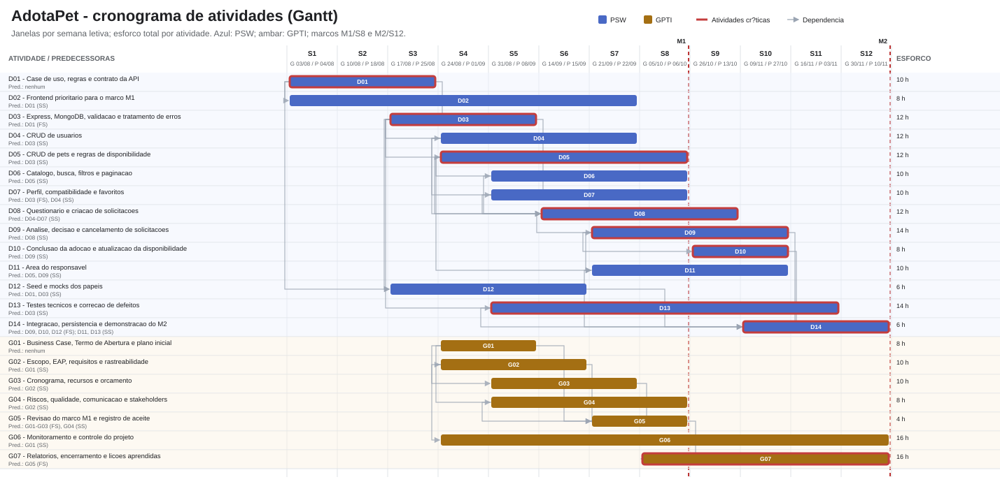
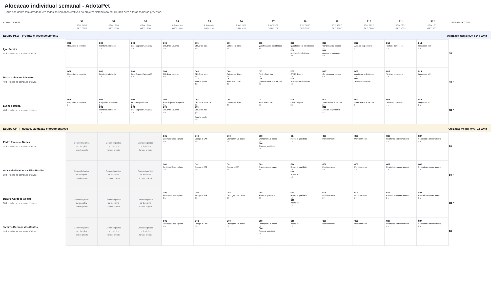
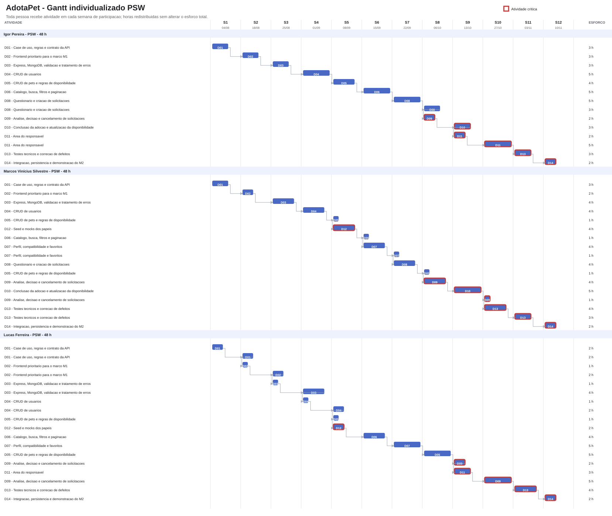
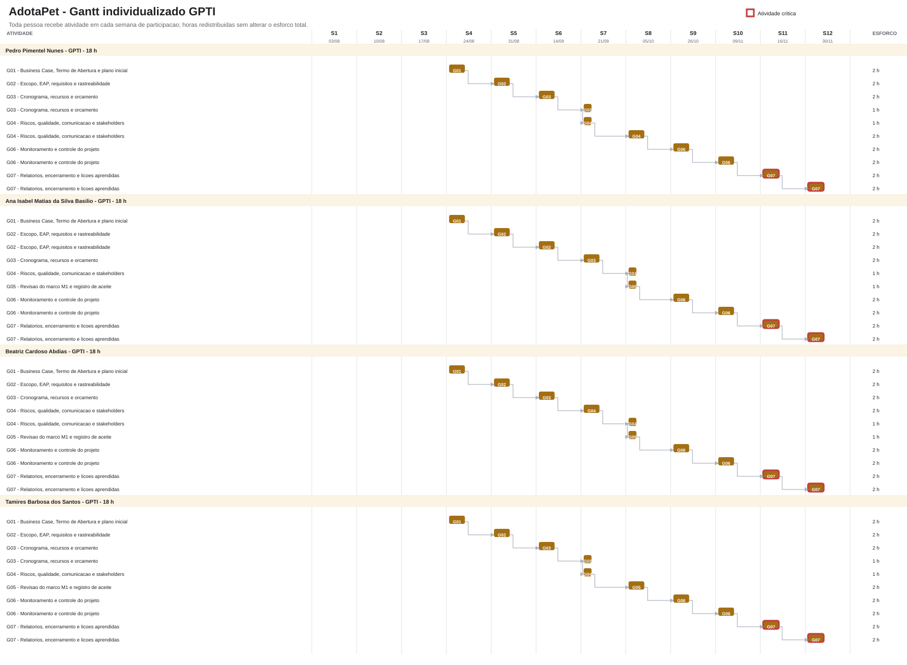

# Plano de Projeto — AdotaPet

**Versão:** 1.0  
**Data:** 05/10/2026  
**Patrocinador:** Prof. Diogo Mendonça  
**Gerente do projeto:** Pedro Pimentel Nunes  
**Equipe:** 3 alunos de PSW (produto e desenvolvimento) e 4 alunos de GPTI (gestão e validação interna)

> Este plano reúne o escopo, as regras de negócio, a EAP, o cronograma, o orçamento, os riscos, o engajamento e os controles do AdotaPet. Em 12 semanas letivas efetivas, de 03/08 a 30/11/2026, a equipe pretende entregar um sistema acadêmico integrado, com frontend React + TypeScript, API Node.js + Express e persistência em MongoDB. As semanas sem aula ampliam o intervalo de calendário, mas não acrescentam semanas de esforço. OAuth será demonstrativo, com identidades fictícias. Não serão utilizados dados pessoais reais nem integrações externas. O [Dicionário da EAP](./dicionario-eap-adotapet.md) detalha os pacotes e critérios de aceite.

**Números da linha de base**

| O quê                                       |                                                                                                Valor | Onde                        |
| ------------------------------------------- | ---------------------------------------------------------------------------------------------------: | --------------------------- |
| Estimativa de iniciação — ordem de grandeza |               360 h de capacidade efetiva; R$ 9.000,00 (faixa de −25% a +75%: R$ 6.750,00–15.750,00) | Termo de Abertura, seção 10 |
| Capacidade efetiva dos calendários          |                                              180 h PSW (12 semanas) + 180 h GPTI (9 semanas) = 360 h | 5.1 e 5.3                   |
| Esforço planejado nas atividades            |                                                                        144 h PSW + 72 h GPTI = 216 h | 5.2, 5.5 e 5.6              |
| Atividades niveladas                        |                                                           144 h PSW + 72 h GPTI = 216 h; R$ 5.400,00 | 5.2 e 6.2                   |
| Segunda estimativa, pelo entregável         |                                            156 h PSW + 70 h GPTI = 226 h; diferença líquida de +10 h | 6.2.1                       |
| Contingência, por eventos nomeados          |                                                    56 h = 32 h técnica + 24 h de gestão; R$ 1.400,00 | 6.3.3                       |
| Linha de base de custos                     |                                                       272 h = atividades + contingência; R$ 6.800,00 | 6.4                         |
| Reserva gerencial, fora da linha de base    |                                                                                       7% = R$ 476,00 | 6.4                         |
| Orçamento total simulado                    |                                                        R$ 7.276,00; desembolso real previsto R$ 0,00 | 6.4                         |
| Marcos                                      | M1 na semana letiva 8 (GPTI 05/10; PSW 06/10); M2 na semana letiva 12 (PSW 10/11; aceite GPTI 30/11) | 5.1 e 5.4                   |

A capacidade efetiva do cronograma considera 12 semanas de PSW e nove semanas de GPTI, conforme as datas e os calendários das disciplinas (3 × 5 × 12 + 4 × 5 × 9 = 360 h). A estimativa de iniciação de R$ 9.000,00 representa a valoração preliminar dessa capacidade total; sua faixa de incerteza é de R$ 6.750,00 a R$ 15.750,00. A linha de base detalhada é calculada separadamente a partir das atividades planejadas e das reservas identificadas: 216 h de atividades, 56 h de contingência e reserva gerencial de 7%. Essa distinção explica por que o orçamento detalhado pode ser menor que a estimativa de iniciação: ele não contabiliza as 88 h de capacidade que permanecem sem atividade ou contingência alocada. Os valores são referências acadêmicas para planejamento, não salários, pagamentos aos estudantes nem desembolsos reais; a memória consolidada está na seção 6.4.

## 1. Objetivo da EAP

Organizar o escopo do AdotaPet em entregas que possam ser planejadas e verificadas, da experiência do adotante e do responsável até API, persistência e validação. Os 17 casos de uso e seus fluxos complementares estão distribuídos nesses componentes; os códigos indicam níveis de decomposição, não a ordem de desenvolvimento.

O produto é um sistema acadêmico demonstrativo. Os dados serão fictícios e persistidos em MongoDB. A solução não será integrada a organizações ou serviços externos nem implantada em produção. O frontend e o `json-server` existentes são base para o primeiro marco e para o desenvolvimento incremental; não reduzem o escopo da entrega final.

## 2. EAP / WBS

### 1.0 Projeto AdotaPet

- **1.1 Gestão e coordenação do projeto**
  - 1.1.1 Plano, decisões, requisitos e mudanças acompanhados
  - 1.1.2 Cronograma, recursos, riscos e custos monitorados
  - 1.1.3 Demonstrações e aceites dos marcos registrados
  - 1.1.4 Documentação de gestão e lições aprendidas consolidadas

- **1.2 Requisitos e desenho funcional**
  - 1.2.1 Atores, papéis e 17 casos de uso detalhados
  - 1.2.2 Fluxos de adoção do adotante e do responsável definidos
  - 1.2.3 Regras de negócio, estados e validações definidos
  - 1.2.4 Modelo de domínio e contratos de API definidos
  - 1.2.5 Dados fictícios, premissas e limitações documentados
  - 1.2.6 Navegação e telas revisadas internamente

- **1.3 Base técnica e ambientes**
  - 1.3.1 Frontend React + TypeScript preparado
  - 1.3.2 API REST Node.js + Express preparada
  - 1.3.3 MongoDB configurado para desenvolvimento
  - 1.3.4 Validação, erros e contratos de dados implementados
  - 1.3.5 Identidades fictícias e permissões por papel preparadas
  - 1.3.6 Endpoints mantidos no `json-server` identificados no contrato

- **1.4 Marco 1 — Frontend dos fluxos prioritários com serviços simulados**
  - 1.4.1 Página inicial, catálogo, busca, filtros e detalhes construídos
  - 1.4.2 Perfil, compatibilidade e favoritos demonstráveis
  - 1.4.3 Questionário e criação de solicitação demonstráveis
  - 1.4.4 Navegação, estados de erro e estados vazios demonstráveis
  - 1.4.5 Serviços simulados e identidade fictícia documentados
  - 1.4.6 Demonstração do M1 e pendências registradas

- **1.5 Backend e regras de negócio**
  - 1.5.1 CRUD de usuários implementado com identidade fictícia e autorização
  - 1.5.2 CRUD de pets implementado com controle de propriedade e disponibilidade
  - 1.5.3 Pesquisa, filtros, ordenação e paginação de pets implementados
  - 1.5.4 Perfil, favoritos e compatibilidade integrados aos dados persistidos
  - 1.5.5 Questionário e criação/consulta de solicitações implementados
  - 1.5.6 Aprovação, recusa e cancelamento implementados conforme os estados
  - 1.5.7 Conclusão da adoção e atualização da disponibilidade implementadas
  - 1.5.8 Persistência de usuários, pets, perfis, favoritos, solicitações e adoções configurada no MongoDB

- **1.6 Integração frontend, API e persistência**
  - 1.6.1 Fluxos do adotante conectados à API
  - 1.6.2 Área do responsável conectada à API
  - 1.6.3 Dados persistidos e respostas validadas conforme os contratos
  - 1.6.4 Erros de validação, autorização e negócio apresentados adequadamente
  - 1.6.5 Endpoints ainda simulados identificados e delimitados

- **1.7 Verificação, demonstração e encerramento**
  - 1.7.1 Testes funcionais, de API, contrato e autorização executados
  - 1.7.2 Fluxos ponta a ponta testados e defeitos críticos corrigidos
  - 1.7.3 Instruções de execução e documentação técnica entregues
  - 1.7.4 Demonstração final e aceite ou pendências do M2 registrados
  - 1.7.5 Limitações e lições aprendidas documentadas

## 3. Regras de negócio do sistema

As regras abaixo orientam a implementação acadêmica e serão validadas internamente. Não representam políticas aprovadas por organizações de proteção animal.

1. **Papéis:** os principais papéis demonstrados são adotante e responsável por pets. As permissões são verificadas no servidor; o adotante administra os próprios dados e solicitações, e o responsável administra os pets sob sua responsabilidade e as solicitações recebidas.
2. **Identidade:** OAuth será simulado com identidades fictícias. Não serão usadas credenciais reais, provedores externos nem dados pessoais reais.
3. **Usuários:** cadastro, consulta, atualização e exclusão devem respeitar papel e vínculos. Operações incompatíveis com solicitações ou adoções relacionadas devem ser recusadas com erro explícito ou regra de integridade definida.
4. **Pets:** o responsável autorizado pode cadastrar, consultar, atualizar e remover pets sob sua responsabilidade. Um pet com solicitação ou adoção vinculada não pode ser removido de modo a deixar registros inconsistentes.
5. **Disponibilidade:** somente pets disponíveis podem receber novas solicitações. Ao concluir a adoção, o sistema registra o vínculo da adoção e deixa o pet indisponível para novas solicitações.
6. **Pesquisa:** pesquisa, filtros, ordenação e paginação são aplicados aos pets disponíveis e devem seguir o contrato da API.
7. **Compatibilidade:** o resultado é orientativo, determinístico e explicável por critérios atendidos e pontos de atenção. Não aprova nem recusa automaticamente uma adoção.
8. **Questionário:** motivação e rotina devem ter de 20 a 500 caracteres; adaptação, de 15 a 350; tempo sozinho deve corresponder a uma opção permitida; custos e compromisso devem ser confirmados. O servidor valida novamente os dados.
9. **Solicitação:** a submissão válida cria um identificador persistido. O envio não equivale à aprovação ou à conclusão da adoção.
10. **Análise:** o responsável autorizado pode aprovar ou recusar solicitações elegíveis. As transições inválidas ou não autorizadas devem ser recusadas.
11. **Cancelamento:** o adotante pode cancelar somente quando permitido pelo estado da solicitação. A operação deve registrar a mudança de estado.
12. **Conclusão:** a adoção só pode ser finalizada por responsável autorizado após as condições definidas para o fluxo. A operação registra a adoção e atualiza a disponibilidade do pet.
13. **Persistência:** usuários, pets, perfis, favoritos, solicitações e adoções demonstrativos persistem em MongoDB. O frontend acessa os dados exclusivamente por APIs.
14. **Mocks:** `json-server` poderá permanecer somente para endpoints explicitamente identificados no contrato; não substitui a API própria prevista para os fluxos de negócio.

## 4. Linha de base do escopo

A linha de base do escopo é composta pela declaração abaixo, pela EAP da seção 2 e pela matriz de rastreabilidade da seção 4.3. Backend, banco de dados, gestão dos pets e análise das solicitações estão incluídos. O estágio atual do produto não altera esta linha de base.

### 4.1 Declaração do escopo

Entregar, em 12 semanas, um sistema acadêmico de adoção responsável com frontend React + TypeScript, API Node.js + Express e persistência em MongoDB. O sistema deverá demonstrar os 17 casos de uso, os fluxos complementares definidos para o adotante e o responsável, dados fictícios persistidos, validação, autorização por papel e tratamento de erros.

O M1, na semana 8, demonstra os fluxos prioritários no frontend com serviços simulados e identidade fictícia. O M2, na semana 12, demonstra a solução integrada à API Express e ao MongoDB, com os casos de uso, testes e documentação. O OAuth permanece mockado nos dois marcos.

**Incluído:** gestão de usuários; CRUD de pets; pesquisa, filtros, ordenação, paginação e detalhes; perfil, compatibilidade e favoritos; questionário; criação e consulta de solicitações; aprovação, recusa, cancelamento e conclusão da adoção; atualização de disponibilidade; API e persistência; testes e documentação.

**Fora do escopo:** OAuth/OIDC ou SSO real; credenciais e dados pessoais reais; integração com organizações, sistemas ou serviços externos; implantação e operação em produção; notificações externas, pagamentos, recuperação de senha ou verificação de e-mail por terceiros, MFA, aplicativo mobile nativo e funcionalidades que não estejam nos casos de uso aprovados.

**Premissas:** sete alunos (três de PSW e quatro de GPTI), até cinco horas semanais por pessoa, dados fictícios, validação acadêmica interna e disponibilidade das ferramentas necessárias.

**Restrições:** prazo de 12 semanas; capacidade efetiva de calendário de 360 horas (180 h PSW e 180 h GPTI, conforme as janelas das disciplinas); aprendizado simultâneo das tecnologias; nenhum acesso a infraestrutura ou dados de terceiros; nenhuma implantação em produção.

**Critério geral de aceite:** ao final da semana 12, a equipe demonstra os 17 casos de uso, registra evidências dos testes e submete ao patrocinador o aceite do M2 ou a relação explícita dos critérios pendentes.

### 4.2 Necessidade e solução

Esta matriz conecta o que cada perfil precisa realizar no AdotaPet às funções que a equipe construirá para atender a essa necessidade. O desenho técnico pode evoluir durante o projeto, desde que preserve o resultado esperado e os critérios de aceite.

| ID     | Necessidade                                         | Origem                              | Solução adotada no AdotaPet                                             |
| ------ | --------------------------------------------------- | ----------------------------------- | ----------------------------------------------------------------------- |
| REQ-01 | Conhecer a proposta e acessar as funções do sistema | Objetivo do produto                 | Página inicial e navegação responsiva                                   |
| REQ-02 | Criar usuário para os fluxos demonstrativos         | Caso de uso: cadastrar usuário      | Cadastro de identidade fictícia, com persistência e papel               |
| REQ-03 | Consultar dados de usuário conforme autorização     | Caso de uso: consultar usuário      | API com consulta restrita pelo papel                                    |
| REQ-04 | Atualizar dados permitidos do usuário               | Caso de uso: atualizar usuário      | API com validação e autorização                                         |
| REQ-05 | Excluir usuário sem inconsistências                 | Caso de uso: excluir usuário        | Exclusão sujeita a autorização e integridade dos vínculos               |
| REQ-06 | Permitir que responsáveis divulguem pets            | Caso de uso: cadastrar pet          | CRUD de pets na área do responsável                                     |
| REQ-07 | Consultar pets e disponibilidade                    | Caso de uso: consultar pet          | Catálogo e detalhes alimentados pela API                                |
| REQ-08 | Manter os dados dos pets atualizados                | Caso de uso: atualizar pet          | Edição autorizada pelo responsável                                      |
| REQ-09 | Remover pets sem corromper dados relacionados       | Caso de uso: excluir pet            | Exclusão validada contra solicitações e adoções                         |
| REQ-10 | Encontrar pets por texto                            | Caso de uso: pesquisar pets         | Pesquisa por nome, raça ou cidade                                       |
| REQ-11 | Reduzir resultados por critérios                    | Caso de uso: filtrar pets           | Filtros definidos no contrato; ordenação e paginação complementares     |
| REQ-12 | Conhecer características e necessidades do pet      | Caso de uso: visualizar detalhes    | Tela de detalhe com história, atributos e disponibilidade               |
| REQ-13 | Guardar pets de interesse                           | Fluxo complementar do adotante      | Favoritos persistidos e sincronizados com o perfil                      |
| REQ-14 | Avaliar orientativamente a compatibilidade          | Fluxo complementar do adotante      | Cálculo determinístico com percentual, classificação e justificativas   |
| REQ-15 | Solicitar adoção com informações suficientes        | Caso de uso: solicitar adoção       | Questionário validado e criação persistida da solicitação               |
| REQ-16 | Acompanhar pedidos recebidos ou enviados            | Caso de uso: consultar solicitações | Consultas separadas e autorizadas por papel                             |
| REQ-17 | Aprovar solicitações elegíveis                      | Caso de uso: aprovar solicitação    | Ação disponível a responsável autorizado, sujeita às transições válidas |
| REQ-18 | Recusar solicitações elegíveis                      | Caso de uso: recusar solicitação    | Ação disponível a responsável autorizado, sujeita às transições válidas |
| REQ-19 | Desistir de uma solicitação quando permitido        | Caso de uso: cancelar solicitação   | Cancelamento pelo adotante conforme o estado                            |
| REQ-20 | Registrar adoção concluída                          | Caso de uso: finalizar adoção       | Registro persistido e atualização da disponibilidade do pet             |

**Requisitos não funcionais**

| ID     | Requisito                                                                                                                              |
| ------ | -------------------------------------------------------------------------------------------------------------------------------------- |
| RNF-01 | O frontend deve utilizar React + TypeScript e o backend próprio deve utilizar Node.js + Express.                                       |
| RNF-02 | Usuários, pets, perfis, favoritos, solicitações e adoções de demonstração devem persistir em MongoDB.                                  |
| RNF-03 | O frontend deve acessar os dados exclusivamente por APIs, sem conexão direta ao banco.                                                 |
| RNF-04 | A API deve validar dados e aplicar autorização por papel no servidor.                                                                  |
| RNF-05 | O fluxo OAuth deve ser simulado com identidades fictícias, sem credenciais reais ou provedor externo.                                  |
| RNF-06 | Endpoints mantidos no `json-server` devem estar identificados no contrato e não substituir a API própria.                              |
| RNF-07 | A interface deve ser responsiva e os elementos interativos devem possuir identificação acessível.                                      |
| RNF-08 | O sistema deve apresentar mensagens compreensíveis para carregamento, ausência de dados, validação, falhas de rede e erros de negócio. |
| RNF-09 | Regras de negócio e contratos devem possuir testes funcionais, de API e de contrato.                                                   |
| RNF-10 | A solução deve ser executável no ambiente de desenvolvimento definido pela equipe, sem implantação em produção.                        |
| RNF-11 | Não devem ser utilizados dados pessoais reais, serviços externos ou integração com sistemas de terceiros.                              |
| RNF-12 | A compatibilidade deve ser determinística, reproduzível e apresentada como orientativa.                                                |

### 4.3 Matriz de rastreabilidade

| ID                     | EAP      | Aceite observável                                                                                                                       |
| ---------------------- | -------- | --------------------------------------------------------------------------------------------------------------------------------------- |
| REQ-01                 | 1.4      | A página inicial explica a proposta e oferece acesso às funções do sistema.                                                             |
| REQ-02–REQ-05          | 1.5      | As operações de usuário persistem e respeitam papel, autorização e vínculos.                                                            |
| REQ-06, REQ-08, REQ-09 | 1.5      | O responsável autorizado administra pets próprios; operações incompatíveis com dados relacionados são recusadas com erro compreensível. |
| REQ-07, REQ-10–REQ-12  | 1.4–1.6  | Consulta, pesquisa, filtros, ordenação, paginação e detalhes exibem resultados coerentes com os dados e a disponibilidade.              |
| REQ-13–REQ-14          | 1.5–1.6  | Perfil e favoritos persistem; a compatibilidade retorna resultado determinístico e orientativo.                                         |
| REQ-15                 | 1.5–1.6  | Questionário inválido não cria solicitação; questionário válido gera solicitação persistida e confirmação com identificador.            |
| REQ-16                 | 1.5–1.6  | Adotante e responsável consultam apenas as solicitações autorizadas ao seu papel.                                                       |
| REQ-17–REQ-18          | 1.5–1.6  | Aprovação e recusa somente ocorrem por responsável autorizado e em estados elegíveis.                                                   |
| REQ-19                 | 1.5–1.6  | Cancelamento permitido muda e persiste o estado; transição não permitida é recusada.                                                    |
| REQ-20                 | 1.5–1.6  | A conclusão registra a adoção e torna o pet indisponível para novas solicitações.                                                       |
| RNF-01–RNF-06          | 1.3, 1.6 | Frontend, API, banco, autorização e endpoints simulados seguem a arquitetura e contratos aprovados.                                     |
| RNF-07–RNF-12          | 1.4–1.7  | Interface responsiva e acessível, erros compreensíveis, testes reproduzíveis, dados fictícios e compatibilidade orientativa.            |

## 5. Processo de elaboração do cronograma

O cronograma foi elaborado a partir da EAP, integrado às capacidades das duas equipes, aos marcos acadêmicos do Termo de Abertura e às dependências entre atividades. As estimativas estão em horas-pessoa.

### 5.1 Planejar o gerenciamento do cronograma

- **Unidade de planejamento:** semana letiva; realizado acompanhado em horas-pessoa.
- **Horizonte:** 12 semanas. M1/AV1 na semana 8; M2 na semana 12.
- **Calendários:** cada participante dispõe de até 5 h/semana. Para a capacidade efetiva do cronograma, PSW participa nas semanas 1–12: 3 × 5 × 12 = 180 h; GPTI participa nas semanas 4–12: 4 × 5 × 9 = 180 h. A capacidade efetiva total é 360 h. GPTI dedica as semanas 1–3 ao conteúdo e à prática da disciplina, conforme o calendário acadêmico adotado.
- **Calendário dos marcos:** M1 de GPTI em 05/10 e de PSW em 06/10; M2 de PSW em 10/11 e aceite GPTI em 30/11, conforme calendário letivo informado no Termo de Abertura. O intervalo até o aceite GPTI não acrescenta horas de desenvolvimento.
- **Ferramentas:** EAP, lista de atividades, quadro de tarefas, rede de precedências e apontamento semanal.
- **Estimativa:** esforço estimado por entrega e nivelado à capacidade de cada equipe; uso de IA não reduz automaticamente o esforço, pois as saídas exigem revisão e testes.
- **Atualização:** progresso medido por esforço realizado, esforço restante e entrega aceita, e não por percentual subjetivo.
- **Limites de controle:** variação prevista acima de 10% de uma atividade, consumo da folga de um marco ou previsão acima de 216 h de atividades exige análise; uso da contingência é limitado aos eventos e horas aprovados na seção 6.3.3. Mudança de escopo, prazo ou orçamento exige controle de mudanças.

|     Semana | GPTI  | PSW   |
| ---------: | ----- | ----- |
|          1 | 03/08 | 04/08 |
|          2 | 10/08 | 18/08 |
|          3 | 17/08 | 25/08 |
|          4 | 24/08 | 01/09 |
|          5 | 31/08 | 08/09 |
|          6 | 14/09 | 15/09 |
|          7 | 21/09 | 22/09 |
| 8 — M1/AV1 | 05/10 | 06/10 |
|          9 | 26/10 | 13/10 |
|         10 | 09/11 | 27/10 |
|         11 | 16/11 | 03/11 |
|    12 — M2 | 30/11 | 10/11 |

As datas acima seguem o calendário acadêmico descrito no Termo de Abertura. O plano controla o prazo por semana letiva e não pressupõe trabalho em dias sem aula.

### 5.2 Definir e sequenciar as atividades

As atividades derivam dos pacotes da EAP. FS significa término–início; atividades paralelas serão acompanhadas no quadro semanal. Quando predecessor e sucessora aparecem na mesma semana, a equipe detalhará a ordem em tarefas menores no quadro. A coluna de esforço é em horas-pessoa. Os valores de custo são estimativas econômicas simuladas por atividade; não representam remuneração ou desembolso real.

#### Atividades de produto — equipes PSW e GPTI

| ID               | Atividade/saída verificável                                        | Predecessora                      |     Janela | Duração |   Esforço | Responsável principal |  Custo estimado |
| ---------------- | ------------------------------------------------------------------ | --------------------------------- | ---------: | ------: | --------: | --------------------- | --------------: |
| D01              | Refinar casos de uso, regras e contrato da API                     | —                                 |      S1–S3 |  3 sem. |      10 h | PSW                   |       R$ 250,00 |
| D02              | Completar os fluxos prioritários do frontend para M1               | D01 (SS)                          |      S1–S7 |  7 sem. |       8 h | PSW                   |       R$ 200,00 |
| D03              | Preparar Express, conexão MongoDB, validação e erros               | D01 (FS)                          |      S3–S5 |  3 sem. |      12 h | PSW                   |       R$ 300,00 |
| D04              | Implementar cadastro, consulta, atualização e exclusão de usuários | D03 (SS)                          |      S4–S7 |  4 sem. |      12 h | PSW                   |       R$ 300,00 |
| D05              | Implementar CRUD de pets e regras de propriedade/disponibilidade   | D03 (SS)                          |      S4–S8 |  5 sem. |      12 h | PSW                   |       R$ 300,00 |
| D06              | Implementar catálogo, pesquisa, filtros e paginação                | D05 (SS)                          |      S5–S8 |  4 sem. |      10 h | PSW                   |       R$ 250,00 |
| D07              | Integrar perfil, compatibilidade e favoritos                       | D03 (FS), D04 (SS)                |      S5–S8 |  4 sem. |      10 h | PSW                   |       R$ 250,00 |
| D08              | Implementar questionário e criação de solicitações                 | D04–D07 (SS)                      |      S6–S9 |  4 sem. |      12 h | PSW                   |       R$ 300,00 |
| D09              | Implementar consulta, aprovação, recusa e cancelamento             | D08 (SS)                          |     S7–S10 |  4 sem. |      14 h | PSW                   |       R$ 350,00 |
| D10              | Implementar conclusão da adoção e atualizar disponibilidade        | D09 (SS)                          |     S9–S10 |  2 sem. |       8 h | PSW                   |       R$ 200,00 |
| D11              | Implementar telas da área do responsável                           | D05, D09 (SS)                     |     S7–S10 |  4 sem. |      10 h | PSW                   |       R$ 250,00 |
| D12              | Preparar seed e mocks delimitados para todos os papéis             | D01, D03 (SS)                     |      S3–S6 |  4 sem. |       6 h | PSW                   |       R$ 150,00 |
| D13              | Executar testes técnicos e corrigir defeitos prioritários          | D03 (SS)                          |     S5–S11 |  7 sem. |      14 h | PSW                   |       R$ 350,00 |
| D14              | Integrar fluxos, validar persistência e preparar demonstração M2   | D09, D10, D12 (FS); D11, D13 (SS) |    S10–S12 |  3 sem. |       6 h | PSW                   |       R$ 150,00 |
| **Subtotal PSW** |                                                                    |                                   | **S1–S12** |         | **144 h** |                       | **R$ 3.600,00** |

#### Atividades de gerenciamento — equipe GPTI

| ID                | Atividade/saída verificável                                  | Predecessora           |     Janela | Duração |  Esforço | Responsável principal |  Custo estimado |
| ----------------- | ------------------------------------------------------------ | ---------------------- | ---------: | ------: | -------: | --------------------- | --------------: |
| G01               | Elaborar Business Case, Termo de Abertura e plano inicial    | —                      |      S4–S5 |  2 sem. |      8 h | GPTI                  |       R$ 200,00 |
| G02               | Detalhar escopo, EAP, requisitos e rastreabilidade           | G01 (SS)               |      S4–S6 |  3 sem. |     10 h | GPTI                  |       R$ 250,00 |
| G03               | Elaborar cronograma, recursos, responsabilidades e orçamento | G02 (SS)               |      S5–S7 |  3 sem. |     10 h | GPTI                  |       R$ 250,00 |
| G04               | Planejar riscos, qualidade, comunicação e stakeholders       | G02 (SS)               |      S5–S8 |  4 sem. |      8 h | GPTI                  |       R$ 200,00 |
| G05               | Revisar M1 e registrar aceite/pendências da AV1              | G01–G03 (FS), G04 (SS) |      S7–S8 |  2 sem. |      4 h | GPTI                  |       R$ 100,00 |
| G06               | Monitorar e controlar cronograma, recursos e riscos          | G01 (SS)               |     S4–S12 |  9 sem. |     16 h | GPTI                  |       R$ 400,00 |
| G07               | Elaborar relatórios, encerramento e lições aprendidas        | G05 (FS)               |     S8–S12 |  5 sem. |     16 h | GPTI                  |       R$ 400,00 |
| **Subtotal GPTI** |                                                              |                        | **S4–S12** |         | **72 h** |                       | **R$ 1.800,00** |

**Total das atividades detalhadas:** 216 h, sendo 144 h de produto (PSW) e 72 h de gerenciamento (GPTI), equivalentes a R$ 5.400,00. A contingência de riscos é estimada separadamente na seção 6.3.3 e não está incluída nas horas das atividades.

### 5.3 Estimar recursos e durações

As durações são janelas de calendário e não equivalem ao esforço total da atividade. As estimativas consideram aprendizagem das tecnologias, integração progressiva, revisão cruzada e testes durante o desenvolvimento. A carga de cada participante não pode exceder 5 h em uma semana.

| Recurso                       | Capacidade semanal máxima | Capacidade efetiva no calendário | Esforço planejado |       Utilização média | Capacidade não alocada |
| ----------------------------- | ------------------------: | -------------------------------: | ----------------: | ---------------------: | ---------------------: |
| PSW — 3 alunos, 12 semanas    |                 5 h/aluno |                            180 h |             144 h | 80% (4 h/aluno/semana) |                   36 h |
| GPTI — 4 alunos, semanas 4–12 |                 5 h/aluno |                            180 h |              72 h | 40% (2 h/aluno/semana) |                  108 h |
| **Total**                     |                           |                        **360 h** |         **216 h** |                **60%** |              **144 h** |

A utilização é calculada dividindo o esforço planejado pela capacidade efetiva do grupo no calendário (5 h × número de alunos × semanas de participação), não pela capacidade de uma única semana. Assim, PSW utiliza 144/(3 × 5 × 12) = 80%, e GPTI utiliza 72/(4 × 5 × 9) = 40%. As médias equivalem a 4 h por aluno de PSW por semana e 2 h por aluno de GPTI nas nove semanas de participação (S4–S12); a carga real varia por semana conforme as atividades. Esses percentuais medem a ocupação média da capacidade, não uma meta que precise ser preenchida: 5 h por pessoa é o limite semanal, e não uma quota de esforço. Não se acrescentam horas sem atividades e entregas justificadas. GPTI não implementa o produto; suas horas são de gestão, requisitos, validação, testes e documentação.

### 5.4 Desenvolver o cronograma e analisar o caminho crítico

As dependências seguem a tabela 5.2. Os testes incrementais (D13) começam quando a base técnica (D03) é iniciada e continuam em paralelo ao desenvolvimento. A integração final (D14) aguarda a conclusão de D09, D10 e D12 e pode avançar em paralelo a D11 e D13. O encerramento GPTI (G07) começa após a revisão do M1 (G05) e prossegue até a semana 12; a janela inclui relatórios e encerramento, não trabalho em semanas sem aula.

| Marco | Saída                                                                                              | Prazo                                   |
| ----- | -------------------------------------------------------------------------------------------------- | --------------------------------------- |
| M1    | Frontend dos fluxos prioritários demonstrável com serviços simulados; aceite acadêmico de GPTI/PSW | Semana 8: GPTI 05/10; PSW 06/10         |
| M2    | Sistema integrado à API Express e MongoDB, 17 casos de uso demonstráveis, testes e documentação    | Semana 12: PSW 10/11; aceite GPTI 30/11 |

**Atividades de atenção crítica ao M2:** D09, D10, D13, D14 e G07 têm pouca margem até o marco e devem concluir no prazo. D11 e D12 também precisam terminar dentro de suas janelas para cobrir a área do responsável e preparar dados repetíveis. O contorno vermelho do Gantt destaca a cadeia principal e as frentes paralelas de teste e encerramento; não significa que todas as atividades obrigatórias sejam uma sequência serial.

#### Gráficos de Gantt do AdotaPet

Os gráficos complementam a rede de dependências com um quadro semanal de alocação individual e Gantts por equipe. Cada semana letiva tem coluna própria; as datas diferentes de PSW e GPTI e as semanas sem aula são mantidas conforme a seção 5.1, sem inserir trabalho em intervalos do calendário. Todos os integrantes têm ao menos uma atividade em cada semana efetiva de participação no projeto. As tarefas foram divididas e redistribuídas entre colegas na mesma semana, mantendo os esforços por atividade, os totais semanais da equipe e a linha de base de 216 h; a distribuição nominal continua sujeita à confirmação da equipe.

#### Alocação individual semanal por atividade

O quadro abaixo detalha, para cada integrante, as atividades, as horas e a semana planejada. As semanas 1–3 de GPTI aparecem como conteúdo e prática da disciplina, fora do projeto; não são horas de atividade, capacidade do projeto ou custo da linha de base. A [visão HTML da alocação AdotaPet](./cronograma-alocacao-adotapet.html) reúne os três gráficos e abre os SVGs em tamanho integral.

#### Gantts individualizados por aluno e atividade

No Gantt geral, as setas ligam as atividades às suas predecessoras FS/SS; nos Gantts individuais, conectam em sequência o trabalho planejado para cada pessoa. Cada linha individual corresponde a uma atribuição em uma semana, a largura da barra representa as horas previstas e o contorno vermelho destaca atividades de atenção crítica ao M2. Só GPTI fica sem barras de trabalho do projeto nas semanas 1–3, quando a equipe ainda não participa do projeto; o quadro semanal identifica esse período como atividade acadêmica externa ao escopo. A alocação nominal é uma proposta a confirmar pela equipe conforme disponibilidade e competências.

### 5.4.1 Folga e técnicas de estimativa

- As atividades niveladas somam 216 h, dentro da capacidade efetiva de calendário de 360 h. A contingência de 56 h é separada e, quando integralmente utilizada, o comprometimento total chega a 272 h; permanecem 88 h de capacidade agregada sem alocação, distribuídas de forma desigual entre as equipes.
- Por equipe, atividades + contingência representam 168/180 h para PSW e 104/180 h para GPTI. A capacidade ociosa de uma equipe não substitui automaticamente a capacidade técnica da outra.
- As atividades de integração, testes e encerramento têm folga limitada; atrasos em D09, D10, D11, D12, D13, D14 ou G07 podem ameaçar diretamente o M2.
- A estimativa é bottom-up por atividade, revisada contra a capacidade semanal. O custo de oportunidade é apresentado como valor econômico simulado na seção 6, não como desembolso salarial.
- A folga só é consumida após registro do risco/impedimento, avaliação de impacto e atualização da previsão. Alterações de escopo ou prazo seguem o controle da seção 8.

### 5.5 Alocação semanal individual — PSW

Cada aluno de PSW tem limite de 5 h/semana. A alocação deriva das horas das atividades e de suas janelas; as tarefas são compartilhadas quando necessário para que cada aluno tenha uma atividade em todas as 12 semanas, sem aumentar o esforço planejado. Os totais individuais somam 144 h para a equipe.

|    Semana | Igor Pereira | Marcos Vinícius Silvestre | Lucas Ferreira | Total PSW | Foco                               |
| --------: | -----------: | ------------------------: | -------------: | --------: | ---------------------------------- |
|         1 |          3 h |                       3 h |            2 h |       8 h | Requisitos e frontend prioritário  |
|         2 |          3 h |                       2 h |            3 h |       8 h | Modelo, contratos e frontend       |
|         3 |          3 h |                       4 h |            3 h |      10 h | API e estrutura                    |
|         4 |          5 h |                       4 h |            5 h |      14 h | CRUDs e seed                       |
|         5 |          4 h |                       5 h |            5 h |      14 h | Usuários, pets e catálogo          |
|         6 |          5 h |                       5 h |            4 h |      14 h | Perfil, questionário e testes      |
|         7 |          5 h |                       5 h |            5 h |      15 h | Solicitações e área do responsável |
|         8 |          5 h |                       5 h |            5 h |      15 h | M1, regras e validação             |
|         9 |          5 h |                       5 h |            5 h |      15 h | Decisões e conclusão               |
|        10 |          5 h |                       5 h |            5 h |      15 h | Integração e persistência          |
|        11 |          3 h |                       3 h |            4 h |      10 h | Testes e correções                 |
|        12 |          2 h |                       2 h |            2 h |       6 h | M2 e entrega técnica               |
| **Total** |     **48 h** |                  **48 h** |       **48 h** | **144 h** |                                    |

### 5.6 Alocação semanal individual — GPTI

Nas semanas 1–3, a equipe GPTI acompanha conteúdo e prática da disciplina, sem produzir entregas do projeto; esse tempo não integra as 72 h planejadas nem o orçamento. Da semana 4 à 12, cada integrante recebe 2 h semanais de atividades de gestão, requisitos, riscos, validação ou encerramento. A distribuição soma 72 h e permanece abaixo do teto de 5 h semanais por pessoa.

|    Semana | Pedro Pimentel Nunes | Ana Isabel Matias da Silva Basilio | Beatriz Cardoso Abdias | Tamires Barbosa dos Santos | Total GPTI |
| --------: | -------------------: | ---------------------------------: | ---------------------: | -------------------------: | ---------: |
|         1 |                  0 h |                                0 h |                    0 h |                        0 h |        0 h |
|         2 |                  0 h |                                0 h |                    0 h |                        0 h |        0 h |
|         3 |                  0 h |                                0 h |                    0 h |                        0 h |        0 h |
|         4 |                  2 h |                                2 h |                    2 h |                        2 h |        8 h |
|         5 |                  2 h |                                2 h |                    2 h |                        2 h |        8 h |
|         6 |                  2 h |                                2 h |                    2 h |                        2 h |        8 h |
|         7 |                  2 h |                                2 h |                    2 h |                        2 h |        8 h |
|         8 |                  2 h |                                2 h |                    2 h |                        2 h |        8 h |
|         9 |                  2 h |                                2 h |                    2 h |                        2 h |        8 h |
|        10 |                  2 h |                                2 h |                    2 h |                        2 h |        8 h |
|        11 |                  2 h |                                2 h |                    2 h |                        2 h |        8 h |
|        12 |                  2 h |                                2 h |                    2 h |                        2 h |        8 h |
| **Total** |             **18 h** |                           **18 h** |               **18 h** |                   **18 h** |   **72 h** |

### 5.7 Matriz de responsabilidades e fazer ou comprar

| Entrega                                      | A — aprovação/conta  | R — execução       |
| -------------------------------------------- | -------------------- | ------------------ |
| 1.1 Gestão e coordenação                     | Pedro Pimentel Nunes | Equipe GPTI        |
| 1.2 Requisitos e desenho                     | Pedro Pimentel Nunes | Equipes GPTI e PSW |
| 1.3 Base técnica e ambientes                 | Equipe PSW           | Equipe PSW         |
| 1.4 Marco 1/frontend prioritário             | Equipe PSW           | Equipe PSW         |
| 1.5 Backend e regras de negócio              | Equipe PSW           | Equipe PSW         |
| 1.6 Integração frontend/API                  | Equipe PSW           | Equipe PSW         |
| 1.7 Verificação, demonstração e encerramento | Pedro Pimentel Nunes | Equipes GPTI e PSW |

O produto será desenvolvido pela equipe. MongoDB, bibliotecas e serviços de desenvolvimento são recursos técnicos; não serão adquiridos sistemas de adoção prontos, provedores externos de identidade ou serviços de produção. `json-server` permanece apenas nos endpoints definidos como simulados.

## 6. Orçamento por composição

### 6.1 Premissas

- O orçamento mede **valor econômico simulado**, não folha salarial nem desembolso real. Não há pagamento previsto aos alunos; ferramentas e infraestrutura são gratuitas ou já disponíveis.
- A estimativa preliminar de iniciação considera a capacidade máxima do calendário (360 h) e resulta em R$ 9.000,00, com faixa de incerteza de −25% a +75% (R$ 6.750,00–15.750,00). É uma referência de ordem de grandeza, não a linha de base detalhada.
- Para a linha de base detalhada, aplica-se um critério uniforme de valoração às horas estimadas; os valores resultantes são custos econômicos simulados e não representam remuneração.
- O desembolso real previsto é R$ 0,00: ferramentas e infraestrutura são gratuitas ou já disponíveis, conforme o Termo de Abertura.
- As atividades niveladas somam 216 h (144 h PSW + 72 h GPTI). A contingência de 56 h é separada, associada a riscos identificados e limitada pela capacidade de cada equipe.
- A linha de base de custos reúne atividades e contingência, totalizando R$ 6.800,00. A reserva gerencial de 7% (R$ 476,00) fica fora da linha de base.
- Não se presume compra de licenças pagas, operação em produção ou contratação de infraestrutura.

### 6.2 Distribuição semanal da linha de base das atividades

|                  Semana |       PSW |     GPTI |     Total | Custo econômico | Saída principal                       |
| ----------------------: | --------: | -------: | --------: | --------------: | ------------------------------------- |
|                       1 |       8 h |      0 h |       8 h |       R$ 200,00 | Requisitos e frontend inicial         |
|                       2 |       8 h |      0 h |       8 h |       R$ 200,00 | Casos de uso e fluxos M1              |
|                       3 |      10 h |      0 h |      10 h |       R$ 250,00 | Contratos, API e seed                 |
|                       4 |      14 h |      8 h |      22 h |       R$ 550,00 | Base técnica, CRUDs e planejamento    |
|                       5 |      14 h |      8 h |      22 h |       R$ 550,00 | Usuários, pets, catálogo e requisitos |
|                       6 |      14 h |      8 h |      22 h |       R$ 550,00 | Perfil, questionário e cronograma     |
|                       7 |      15 h |      8 h |      23 h |       R$ 575,00 | Solicitações, testes e preparação M1  |
|                       8 |      15 h |      8 h |      23 h |       R$ 575,00 | M1/AV1, aceite e gestão de riscos     |
|                       9 |      15 h |      8 h |      23 h |       R$ 575,00 | Decisões, conclusão e relatórios      |
|                      10 |      15 h |      8 h |      23 h |       R$ 575,00 | Integração de fluxos e persistência   |
|                      11 |      10 h |      8 h |      18 h |       R$ 450,00 | Testes, correções e acompanhamento    |
|                      12 |       6 h |      8 h |      14 h |       R$ 350,00 | M2 e encerramento                     |
| **Total de atividades** | **144 h** | **72 h** | **216 h** | **R$ 5.400,00** |                                       |

Os valores semanais são arredondados para centavos; o total é calculado sobre as horas agregadas. A distribuição decorre das atividades e de suas janelas, não de uma quota semanal fixa.

### 6.2.1 Conferência: pacote contra o calendário dos recursos

A carga das atividades varia conforme as janelas: PSW planeja de 6 a 15 h por semana, com máximo de 5 h por aluno; GPTI planeja 8 h semanais entre S4 e S12, também abaixo do limite de 5 h por pessoa. A capacidade não utilizada em cada semana não é esforço de atividade automaticamente comprometido.

| Grupo     | Capacidade efetiva no calendário | Atividades niveladas | Margem antes de contingência |
| --------- | -------------------------------: | -------------------: | ---------------------------: |
| PSW       |                            180 h |                144 h |                         36 h |
| GPTI      |                            180 h |                 72 h |                        108 h |
| **Total** |                        **360 h** |            **216 h** |                    **144 h** |

O calendário nivelado é uma estimativa de esforço das atividades, não o preenchimento integral da capacidade. A segunda estimativa independente pelo entregável é 226 h: 156 h PSW e 70 h GPTI, diferença líquida de +10 h em relação ao calendário. A contingência de 56 h é calculada separadamente e não deve ser somada à segunda estimativa; ambas são verificações/respostas, não trabalho simultâneo.

| Pacote da EAP                                | Atividades da linha de base |       PSW |     GPTI |     Total |
| -------------------------------------------- | --------------------------- | --------: | -------: | --------: |
| 1.1 Gestão e coordenação do projeto          | G01, G03, G04, G06          |       0 h |     42 h |      42 h |
| 1.2 Requisitos e desenho funcional           | D01, G02                    |      10 h |     10 h |      20 h |
| 1.3 Base técnica e ambientes                 | D03, D12                    |      18 h |      0 h |      18 h |
| 1.4 Marco 1 — frontend prioritário           | D02                         |       8 h |      0 h |       8 h |
| 1.5 Backend e regras de negócio              | D04–D11                     |      88 h |      0 h |      88 h |
| 1.6 Integração frontend, API e persistência  | D14                         |       6 h |      0 h |       6 h |
| 1.7 Verificação, demonstração e encerramento | D13, G05, G07               |      14 h |     20 h |      34 h |
| **Total**                                    |                             | **144 h** | **72 h** | **216 h** |

**Segunda estimativa por entregável (independente do calendário):**

| Pacote da EAP                                | Premissa resumida da estimativa independente               |       PSW |     GPTI |     Total | Diferença para a linha de base |
| -------------------------------------------- | ---------------------------------------------------------- | --------: | -------: | --------: | -----------------------------: |
| 1.1 Gestão e coordenação do projeto          | Planejamento, governança, riscos e acompanhamento          |       0 h |     44 h |      44 h |                           +2 h |
| 1.2 Requisitos e desenho funcional           | Fluxos, regras, critérios, contratos e rastreabilidade     |      14 h |      8 h |      22 h |                           +2 h |
| 1.3 Base técnica e ambientes                 | Express, MongoDB, validação, permissões e seed             |      22 h |      0 h |      22 h |                           +4 h |
| 1.4 Marco 1 — frontend prioritário           | Navegação, telas prioritárias e mocks demonstráveis        |      12 h |      0 h |      12 h |                           +4 h |
| 1.5 Backend e regras de negócio              | CRUDs, pesquisa, perfil, solicitações, estados e conclusão |      84 h |      0 h |      84 h |                           −4 h |
| 1.6 Integração frontend, API e persistência  | Conexão dos fluxos, persistência e respostas da API        |       8 h |      0 h |       8 h |                           +2 h |
| 1.7 Verificação, demonstração e encerramento | Testes, aceite, evidências, documentação e encerramento    |      16 h |     18 h |      34 h |                            0 h |
| **Total por entregável**                     | **Estimativa independente do calendário**                  | **156 h** | **70 h** | **226 h** |               **+10 h (4,6%)** |

A segunda estimativa independente por entregável é 10 h maior que a linha de base: PSW 156 h e GPTI 70 h, contra 144 h e 72 h niveladas. O aumento líquido concentra-se em requisitos, base técnica e preparação do M1, parcialmente compensado pela estimativa menor do backend; verificação e encerramento mantêm a estimativa de 34 h. A linha de base continua sendo 216 h e cabe no calendário nivelado; as 10 h de diferença são sinal de atenção, não contingência automática.

### 6.3 Análise qualitativa e reserva de contingência

#### 6.3.1 Escalas e priorização

- **Probabilidade:** baixa até 25%; média de 26% a 50%; alta acima de 50%.
- **Impacto:** baixo até 8 h; médio de 9 h a 16 h; alto a partir de 17 h.
- **Prioridade alta:** combinações com probabilidade e impacto altos, ou uma dimensão alta e outra média.
- **Prioridade média:** combinações média/média, alta/baixa ou baixa/alta.
- **Prioridade baixa:** combinações restantes de impacto e probabilidade baixos.

Probabilidades e impactos são estimativas iniciais e serão revistos nos acompanhamentos. Impactos em horas representam esforço de retrabalho ou atraso esperado e não autorizam exceder o calendário individual.

#### 6.3.2 Registro e respostas aos riscos

| ID   | Risco e impacto                                                               | Probabilidade |      Impacto | Prioridade | Mitigação preventiva                                              | Gatilho e contingência                                                                  | Responsável        |
| ---- | ----------------------------------------------------------------------------- | ------------: | -----------: | ---------- | ----------------------------------------------------------------- | --------------------------------------------------------------------------------------- | ------------------ |
| RT01 | Aprendizagem em React, Express ou MongoDB exigir mais esforço e ameaçar M1/M2 |   35% — média |  20 h — alto | Alta       | Incrementos pequenos, pareamento e revisão técnica                | Atraso de atividade técnica acima de 10%; reordenar trabalho e consumir margem aprovada | Equipe PSW         |
| RT02 | Defeitos em compatibilidade ou validação do questionário                      |   30% — média | 12 h — médio | Média      | Testes determinísticos no cliente e servidor                      | Falha em cenário de aceite; corrigir e executar regressão                               | Equipe PSW         |
| RT03 | Divergência entre frontend, API e dados MongoDB atrasar integração            |   40% — média |  20 h — alto | Alta       | Contratos e testes de API desde o início; integração incremental  | Teste de contrato falha ou endpoint não disponível; priorizar adaptação e fluxo crítico | Equipe PSW         |
| RT04 | Estados inválidos permitirem decisão/cancelamento/conclusão indevidos         |   25% — baixa |  20 h — alto | Média      | Matriz de transições e testes de autorização                      | Transição proibida aceita; bloquear demonstração até correção                           | Equipe PSW         |
| RT05 | Seed não cobrir perfis, papéis, estados e casos de erro                       |   20% — baixa | 10 h — médio | Baixa      | Dados fictícios variados e repetíveis                             | Cenário de teste sem dados; completar seed e repetir teste                              | PSW + GPTI         |
| RT06 | Conflito ou perda de alterações no repositório                                |   30% — média |  17 h — alto | Alta       | Commits frequentes, branches e revisões                           | Conflito compromete integração; recuperar histórico e reaplicar mudanças revisadas      | Equipe PSW         |
| RG01 | Regras de negócio insuficientes causarem retrabalho entre os fluxos           |   30% — média | 16 h — médio | Média      | Detalhar estados, permissões e critérios antes de implementar     | Regra ambígua bloqueia atividade; registrar decisão e atualizar requisito/contrato      | Equipe GPTI        |
| RG02 | Amplitude do escopo exceder a capacidade no prazo acadêmico                   |   40% — média |  20 h — alto | Alta       | Acompanhar caminho crítico e margem semanal                       | Previsão ameaça M2; propor replanejamento formal sem excluir casos silenciosamente      | Gerente do projeto |
| RG03 | Sistema acadêmico ser confundido com solução pronta para operação real        |   20% — baixa |  17 h — alto | Média      | Identificar dados fictícios, OAuth mockado e ausência de produção | Usuário interpretar como serviço real; reforçar limitações na documentação/demonstração | Equipe GPTI        |
| RG04 | Endpoints mockados permanecerem sem delimitação clara                         |   30% — média | 12 h — médio | Média      | Registrar endpoint, finalidade e contrato de cada mock            | Integração ambígua; corrigir documentação ou migrar o fluxo para API própria            | PSW + GPTI         |

Oportunidades: reutilizar componentes reduz retrabalho; tipagem e contratos compartilhados reduzem erros; dados fictícios persistidos permitem demonstrações reproduzíveis; integração incremental antecipa problemas.

#### 6.3.3 Exposição esperada e reserva reavaliada

As exposições esperadas são calculadas por probabilidade × impacto: 30,7 h para riscos técnicos e 19,8 h para riscos de gestão, totalizando 50,5 h (aproximadamente 51 h). A reserva de 56 h arredonda esses valores para blocos executáveis pelas equipes: 32 h técnicas (24 h PSW + 8 h GPTI em testes/validação) e 24 h de gestão (GPTI). A reserva não é atividade planejada; só pode ser consumida quando o evento nomeado ocorrer e após registro/aprovação.

| Evento de risco                                              | Fatia máxima | Quem executa             |
| ------------------------------------------------------------ | -----------: | ------------------------ |
| RT01 — dificuldade técnica além da estimativa                |          8 h | PSW                      |
| RT02 — questionário/compatibilidade falha em teste           |          4 h | PSW                      |
| RT03 — integração Express/MongoDB atrasa                     |          8 h | PSW 6 h + GPTI 2 h       |
| RT04 — transição inválida ou autorização incorreta           |          6 h | PSW 4 h + GPTI 2 h       |
| RT05 — seed não cobre cenário necessário                     |          2 h | GPTI                     |
| RT06 — conflito ou perda de alterações no repositório        |          4 h | PSW 2 h + GPTI 2 h       |
| **Subtotal técnico**                                         |     **32 h** | **PSW 24 h + GPTI 8 h**  |
| RG01 — regra/critério precisa de nova decisão                |          6 h | GPTI                     |
| RG02 — previsão de escopo ameaça o prazo/capacidade          |          8 h | GPTI                     |
| RG03 — limitações do produto acadêmico são mal interpretadas |          6 h | GPTI                     |
| RG04 — delimitação de endpoint mock exige revisão            |          6 h | GPTI                     |
| **Subtotal de gestão**                                       |     **24 h** | **GPTI 24 h**            |
| **Total**                                                    |     **56 h** | **PSW 24 h + GPTI 32 h** |

Com a contingência totalmente utilizada, PSW consome 168 h de 180 h disponíveis (93,3%) e GPTI 104 h de 180 h disponíveis (57,8%). Restariam 12 h de capacidade PSW e 76 h GPTI, sem transferência automática entre equipes. A menor utilização GPTI não significa, por si só, atividade faltante: as 72 h planejadas correspondem ao trabalho de gestão estimado, e a contingência só é consumida se os riscos ocorrerem. Nenhum aluno ultrapassa o teto de 5 h/semana. Necessidade acima dessas fatias exige replanejamento formal, sem horas extras presumidas.

### 6.4 Linha de base de custos e orçamento

| Componente                                 | Base da estimativa                      |  Valor simulado |
| ------------------------------------------ | --------------------------------------- | --------------: |
| Atividades PSW                             | Esforço planejado: 144 h                |     R$ 3.600,00 |
| Atividades GPTI                            | Esforço planejado: 72 h                 |     R$ 1.800,00 |
| **Custo das atividades**                   | **Esforço planejado: 216 h**            | **R$ 5.400,00** |
| Contingência técnica — PSW                 | Reserva para riscos identificados: 24 h |       R$ 600,00 |
| Contingência técnica — GPTI (apoio/testes) | Reserva para riscos identificados: 8 h  |       R$ 200,00 |
| Contingência de gestão — GPTI              | Reserva para riscos identificados: 24 h |       R$ 600,00 |
| **Linha de base de custos**                | **Atividades + contingência: 272 h**    | **R$ 6.800,00** |
| Reserva gerencial                          | 7% da linha de base                     |       R$ 476,00 |
| **Orçamento total simulado**               | **Linha de base + reserva gerencial**   | **R$ 7.276,00** |

O orçamento total simulado da linha de base detalhada é de **R$ 7.276,00**, inferior à estimativa preliminar de iniciação de R$ 9.000,00 porque considera somente o esforço das atividades e as reservas aprovadas, não toda a capacidade disponível. Representa valor econômico estimado para planejamento; desembolso real previsto: **R$ 0,00**. Não se mantém provisão para ferramentas, pois o Termo de Abertura prevê recursos gratuitos ou já disponíveis.

## 7. Plano de engajamento das partes interessadas

### 7.1 Premissas e níveis de engajamento

O patrocinador acompanha os marcos e decisões relevantes. GPTI planeja, acompanha e valida internamente; PSW desenvolve e testa o produto. Adotantes, responsáveis e organizações são representados por dados e identidades fictícios; sua inclusão como stakeholders não presume participação ou validação externa.

### 7.2 Matriz de avaliação do engajamento

| Stakeholder                               | Atual    | Desejado                                   |
| ----------------------------------------- | -------- | ------------------------------------------ |
| Prof. Diogo Mendonça — patrocinador       | Neutro   | Apoiador e ciente dos marcos               |
| Pedro Pimentel Nunes — gerente do projeto | Apoiador | Líder                                      |
| Equipe GPTI                               | Apoiador | Líder em gestão e validação interna        |
| Equipe PSW                                | Apoiador | Líder na execução técnica                  |
| Adotantes potenciais                      | Neutro   | Apoiador por demonstração interna          |
| Responsáveis por pets                     | Neutro   | Fluxo representado e validado internamente |
| Organizações externas                     | Neutro   | Neutro; sem participação presumida         |

### 7.2.1 Poder, interesse e estratégia

| Stakeholder           | Poder | Interesse | Impacto | Estratégia                                        |
| --------------------- | ----- | --------- | ------- | ------------------------------------------------- |
| Patrocinador          | Alto  | Alto      | Alto    | Gerenciar de perto e solicitar decisão nos marcos |
| Gerente do projeto    | Alto  | Alto      | Alto    | Coordenar planejamento e escalonamento            |
| GPTI                  | Alto  | Alto      | Alto    | Manter envolvida na gestão, riscos e validação    |
| PSW                   | Alto  | Alto      | Alto    | Manter envolvida na implementação e integração    |
| Adotante potencial    | Baixo | Alto      | Médio   | Considerar nos cenários demonstrativos            |
| Responsável por pet   | Baixo | Alto      | Alto    | Cobrir seus fluxos com identidade fictícia        |
| Organizações externas | Baixo | Médio     | Futuro  | Não presumir validação nem compromisso            |

### 7.3 Plano breve de engajamento

| Stakeholder         | Objetivo                                | Ação                              | Frequência           | Responsável          |
| ------------------- | --------------------------------------- | --------------------------------- | -------------------- | -------------------- |
| Patrocinador        | Acompanhar progresso e decisões         | Demonstração e registro de aceite | M1/S8 e M2/S12       | Pedro Pimentel Nunes |
| Equipe de projeto   | Manter alinhamento de atividades        | Reunião e atualização do quadro   | Semanal              | Gerente do projeto   |
| Desenvolvedores PSW | Integrar e revisar entregas técnicas    | Revisão de código e testes        | Contínuo             | Equipe PSW           |
| GPTI                | Validar requisitos, riscos e evidências | Revisão interna e relatório       | Semanal e nos marcos | Equipe GPTI          |
| Usuários potenciais | Verificar compreensão dos fluxos        | Demonstrações com dados fictícios | M1 e M2              | GPTI + PSW           |

### 7.4 Cadência de comunicação

| Comunicação                       | Público               | Canal                 | Frequência        | Responsável        |
| --------------------------------- | --------------------- | --------------------- | ----------------- | ------------------ |
| Reunião de acompanhamento         | Equipe                | Reunião/chat          | Semanal           | Gerente do projeto |
| Atualização de tarefas e horas    | Equipe                | Quadro/repositório    | Semanal           | Todos              |
| Registro de decisões              | Equipe e patrocinador | Documento/repositório | Quando necessário | Gerente + GPTI     |
| Relatório de progresso            | Patrocinador          | Documento             | Quinzenal         | Gerente do projeto |
| Demonstrações                     | Patrocinador e equipe | Apresentação          | M1/S8 e M2/S12    | GPTI + PSW         |
| Registro de riscos e impedimentos | Equipe                | Quadro/documento      | Semanal           | GPTI               |

### 7.5 Monitoramento do engajamento

GPTI revisará o engajamento nos marcos e quando houver mudança de expectativa, dependência ou disponibilidade. Questões, decisões pendentes e solicitações externas serão registradas e encaminhadas pelo processo de controle. Toda demonstração informará que os dados são fictícios, a identidade é mockada e o sistema não está implantado em produção.

## 8. Controlar o cronograma, os recursos e os custos

Uma mudança de linha de base começa por solicitação registrada, com pacote afetado e impacto em escopo, prazo, recursos e custo. O gerente do projeto e GPTI analisam; mudanças relevantes de escopo, prazo ou orçamento são submetidas ao patrocinador. As linhas de base são atualizadas em conjunto após aprovação.

- Cada integrante informa semanalmente horas realizadas, esforço restante, impedimentos e saída concluída por ID de atividade.
- GPTI atualiza previsão de término, capacidade usada, riscos, custo econômico e situação dos marcos.
- Uma atividade recebe crédito quando sua saída verificável atende ao aceite; percentual subjetivo não substitui evidência.
- Desvio previsto acima de 10%, risco ao caminho crítico ou previsão de esforço acima de 216 h nas atividades (ou 272 h incluindo contingência aprovada) exige análise e ação corretiva.
- Testes de qualidade cobrem: CRUD e autorização de usuários/pets; busca, filtros e paginação; persistência de favoritos e perfil; compatibilidade; validações do questionário; consultas e transições de solicitações; conclusão e atualização da disponibilidade; erros e cenários de rede.
- Estados inválidos, falhas de autorização e defeitos críticos devem ser corrigidos antes da demonstração final ou registrados como critério pendente, sem serem omitidos do aceite.
- Contingência só é usada contra risco identificado. O uso da margem de capacidade ou da reserva financeira não altera o escopo por si só.
- Aceites internos são registrados no M1 (semana 8) e M2 (semana 12), com ciência do patrocinador.
- No encerramento, GPTI registra aceite ou pendências, resultados dos testes, limitações, riscos ocorridos e lições aprendidas.

**Critério de encerramento:** entrega demonstrada na semana 12, evidências e documentação arquivadas, limitações acadêmicas registradas e decisão do patrocinador documentada. As limitações incluem ausência de OAuth real, dados pessoais reais, integração com terceiros e implantação em produção; a API própria e o MongoDB são parte do escopo, não limitações nem evoluções futuras.
